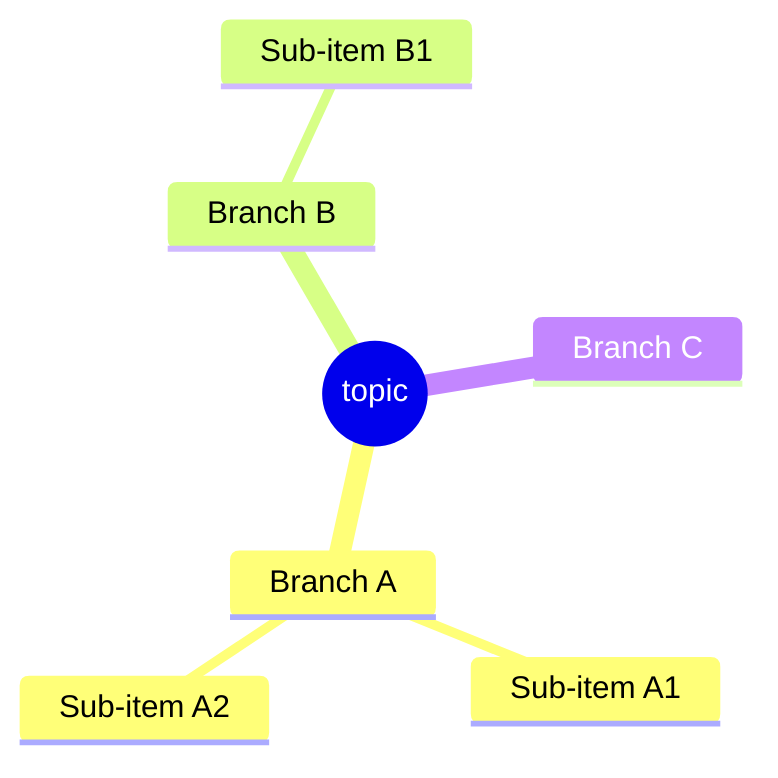
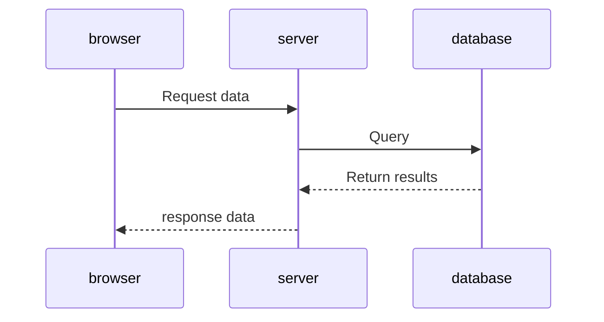
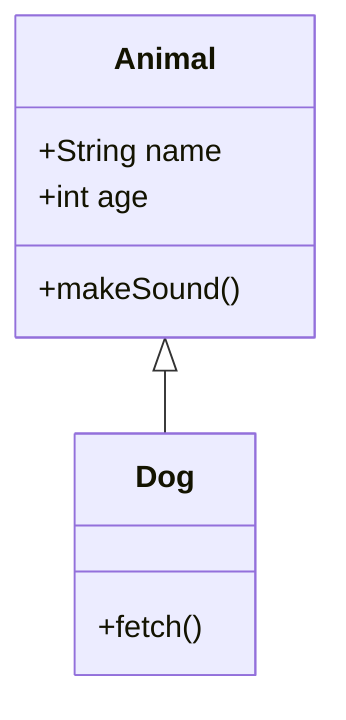
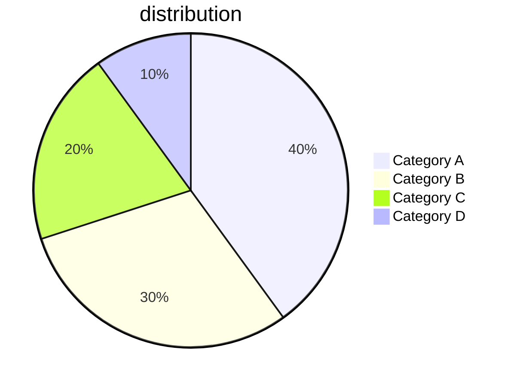
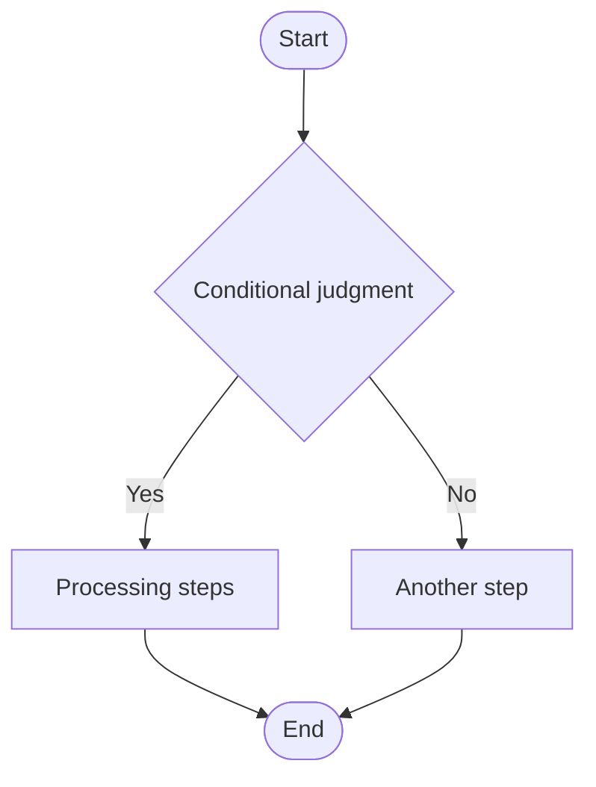
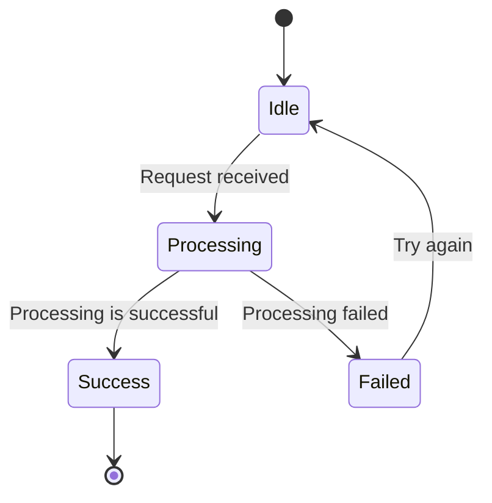

# Mermaid chart path

This scenario is mutually exclusive with DSL paths.

| | DSL Path | Mermaid Path |
|---|---|---|
| Intermediate format | JSON (WBDocument) | Mermaid text (.mmd file) |
| Layout control | Precise control (x/y coordinates, Flex) | Automatic layout by parser-kit |
| Visual customization | Full control (color, font size, rounded corners, etc.) | Limited (Mermaid syntax) |
| Reference module | references/ + corresponding scene | This file only |

## Applicable conditions

Use when any of the following conditions are met:
- The user explicitly requested "Use Mermaid" or "Export Mermaid"
- User pasted Mermaid syntax text directly
- Diagram types are mind maps, sequence diagrams, class diagrams, pie charts, flow charts (automatic routing)

## CLI usage

```bash
npx -y @larksuite/whiteboard-cli@^0.1.0 -i diagram.mmd -o output.png
```

## Mindmap



## Sequence Diagram



Message type:
- `->>` solid arrow (synchronous request)
- `-->>` dashed arrow (responsive/asynchronous)
- `-x` with x arrow (fails)

## Class Diagram



## Pie Chart



## Flowchart

Suitable for: business processes, approval flows, order processing processes and other scenarios with clear sequences and branch judgments.



### Constraints and specifications

- **Node text ≤ 8 words** (if more than necessary, add a legend if necessary)
- Judgment nodes (diamond-shaped) only write conditional keywords and do not write long descriptions
- Number of steps ≤ 12 (more steps need to be merged or split into sub-processes)
- Follow standard flowchart notation: stadium shape or circle `A([start])` for start/end, diamond `B{judgement}` for judgment, rectangle `C[step]` for steps

### Grammar reference

Direction: `TD` (top to bottom), `LR` (left to right), `BT` (bottom to top), `RL` (right to left)

Node shape: `A[rectangle]`, `A(rounded corners)`, `A{rhombus}`, `A((circle))`, `A([stadium])`, `A[[subroutine]]`

Connections: `-->` (solid line), `-.->` (dotted line), `==>` (thick line), `-->|label|` (with label)

## State Diagram



## Other supported chart types

- **Gantt Chart**: `gantt`
- **ER Diagram**: `erDiagram`
- **Git branch graph**: `gitGraph`

## Notes

- Output plain Mermaid text, not JSON, don't mix DSL
- When the node text contains special characters, wrap it in double quotes: `A["Text containing (brackets)"]`
- `subgraph` for logical grouping
- The flow chart defaults to `TD` (top to bottom). If the process is wider (many steps but shallow levels), use `LR` (left to right).
